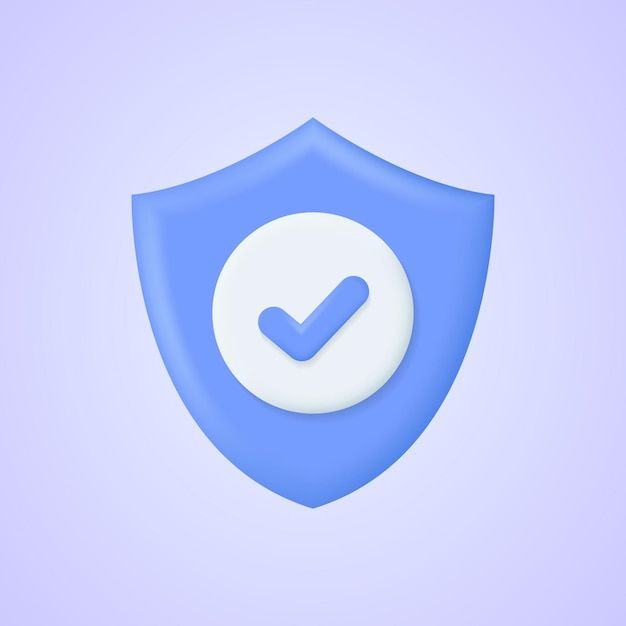
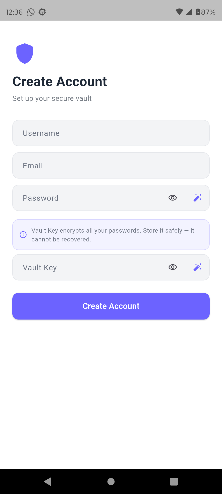
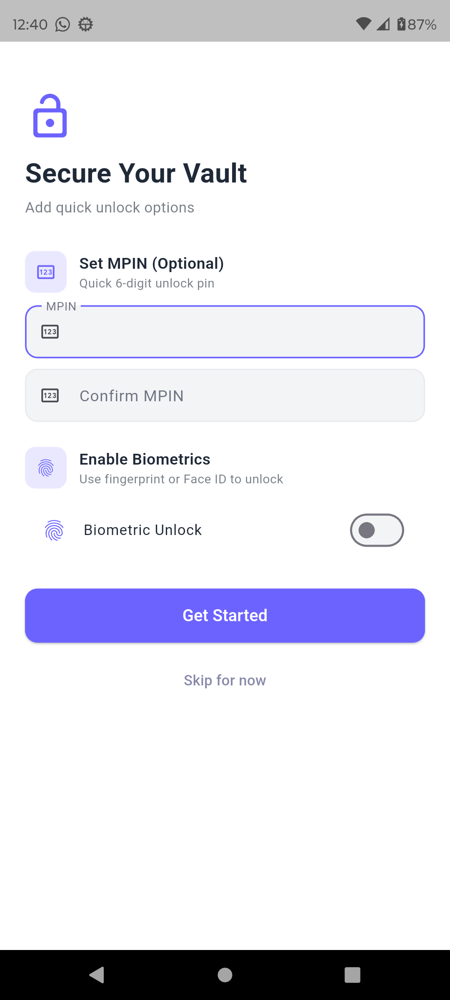
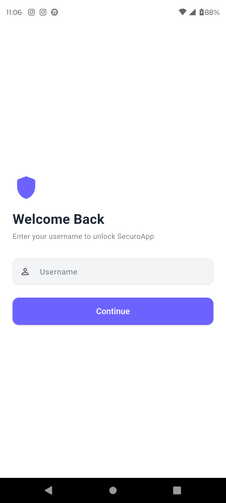
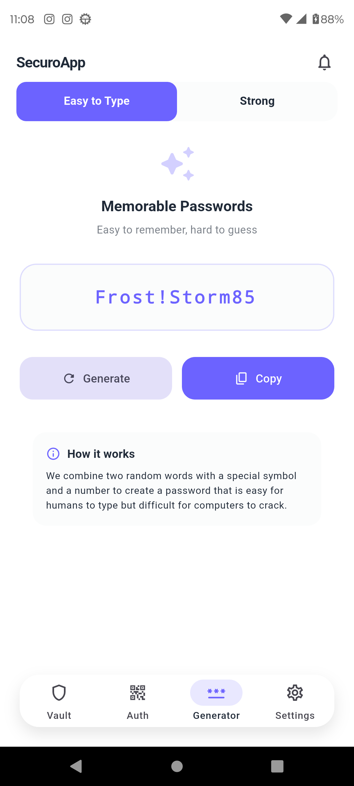
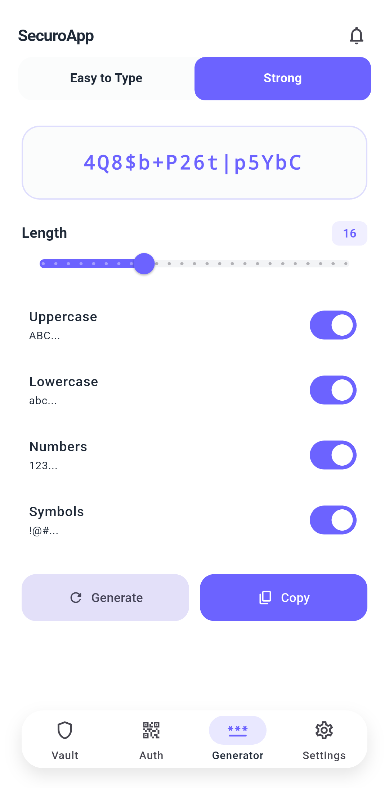
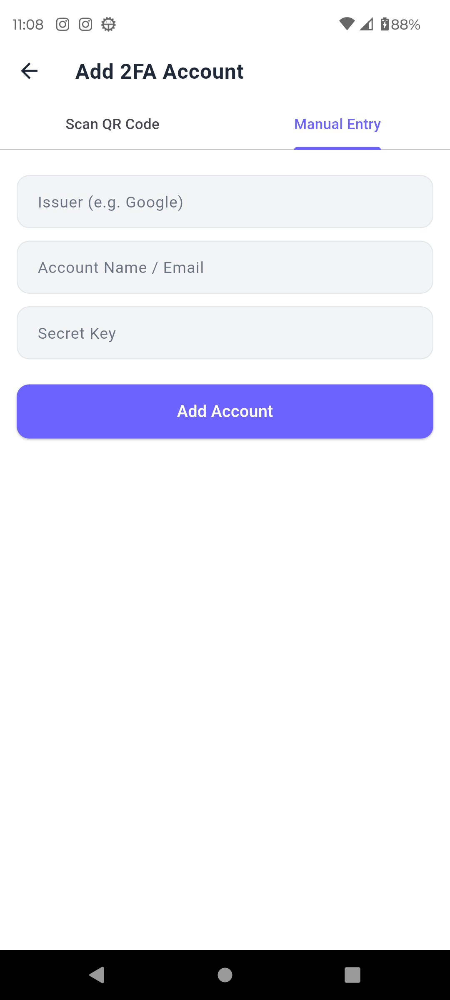
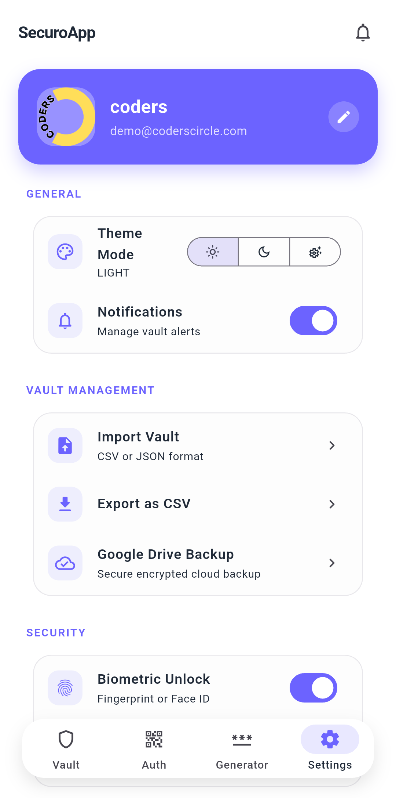

<div align="center">
  

  # SecuroApp

  **Your Secure Vault — Password Manager & 2FA Authenticator**

  [](https://flutter.dev)
  [](https://dart.dev)
  [](https://flutter.dev)
  [](LICENSE)
</div>

---

## 📖 About

**SecuroApp** is a powerful and privacy-focused password manager designed to keep your digital life secure without relying on the internet. All your data is stored locally on your device, giving you full control and eliminating risks associated with cloud storage.

With SecuroApp, you can safely store and manage passwords, generate strong credentials, and use a built-in authenticator for two-factor authentication. It is built for users who value security, simplicity, and complete offline access.

### Key Features

**🔒 Offline First Security**
All data is stored locally on your device. No servers, no syncing, and no external access. Your information stays completely under your control.

**🗄️ Secure Password Vault**
Store and organize passwords for apps, websites, and services in one secure place. Easily manage and access your credentials anytime.

**📲 Built-in Authenticator**
Generate time-based one-time passwords for two-factor authentication. Enhance account security without needing a separate app.

**🎲 Password Generator**
Create strong and unique passwords instantly. Customize length and complexity to meet your security needs.

**🎨 Simple and Clean Interface**
Designed with a modern and minimal interface for easy navigation and quick access to your data.

**🛡️ Privacy Focused**
No tracking, no data collection, and no unnecessary permissions. Your privacy is fully respected.

**🔑 Optional Security Access**
Protect your vault with PIN, biometric authentication, or device-level security for added protection.

### Who is it for?

SecuroApp is ideal for individuals who want a reliable password manager without depending on cloud services. Whether you are a professional, developer, or everyday user, it ensures your credentials remain safe and accessible offline.

### Why choose SecuroApp?

Unlike many password managers that rely on cloud storage, SecuroApp keeps everything on your device. This reduces exposure to online threats and gives you complete ownership of your sensitive information.

> Take control of your digital security with SecuroApp. **Simple, secure, and completely offline.**

---

## ✨ Features

- 🔐 **Encrypted Password Vault** — Store credentials secured with AES encryption
- 🔑 **Vault Key** — Master key that encrypts all your passwords (never stored in plain text)
- 📲 **2FA Authenticator** — TOTP codes via QR scan or manual entry
- 🎲 **Password Generator** — Memorable (Easy to Type) & Strong (Configurable) modes
- 🧬 **Biometric Unlock** — Fingerprint / Face ID support
- 🔢 **MPIN** — Quick 6-digit unlock pin
- ☁️ **Google Drive Backup** — Encrypted cloud backup
- 📤 **Import / Export** — CSV & JSON vault management
- 🌓 **Theme Support** — Light, Dark & System modes
- 🔔 **Vault Notifications** — Manage security alerts

---

## 📸 Screenshots

<table>
  <tr>
    <td align="center">
      <br/>
      <b>Splash Screen</b>
    </td>
    <td align="center">
      <br/>
      <b>Create Account</b>
    </td>
    <td align="center">
      <br/>
      <b>Secure Your Vault</b>
    </td>
    <td align="center">
      <br/>
      <b>Login</b>
    </td>
  </tr>
  <tr>
    <td align="center">
      <br/>
      <b>Generator — Easy to Type</b>
    </td>
    <td align="center">
      <br/>
      <b>Generator — Strong</b>
    </td>
    <td align="center">
      <br/>
      <b>Add 2FA Account</b>
    </td>
    <td align="center">
      <br/>
      <b>Settings</b>
    </td>
  </tr>
</table>

---

## 🚀 Getting Started

### Prerequisites

- Flutter SDK `>=3.22.0`
- Dart SDK `>=3.3.0`
- Android Studio / VS Code

### Installation

```bash
# Clone the repository
git clone https://github.com/CodersCircle/SecuroApp.git
cd SecuroApp

# Install dependencies
flutter pub get

# Run code generation (Drift DB)
dart run build_runner build --delete-conflicting-outputs

# Run the app
flutter run
```

---

## 🏗️ Project Structure

```
lib/
├── main.dart
├── app.dart
├── core/              # Theme, constants, utilities
├── database/          # Drift database & DAOs
├── features/
│   ├── vault/         # Password vault screens
│   ├── authenticator/ # 2FA TOTP screens
│   ├── generator/     # Password generator
│   └── settings/      # App settings
├── models/            # Data models
├── screens/           # Auth & onboarding screens
├── services/          # Encryption, biometrics, backup
└── widgets/           # Shared UI components
```

---

## 🔒 Security

| Layer | Implementation |
|---|---|
| Encryption | AES-256 via `encrypt` + `pointycastle` |
| Key Storage | `flutter_secure_storage` |
| Biometrics | `local_auth` (Fingerprint / Face ID) |
| Database | SQLite via `drift` (encrypted) |
| Backup | Google Drive with encrypted payload |

---

## 📦 Key Dependencies

| Package | Purpose |
|---|---|
| `drift` | Local SQLite database ORM |
| `encrypt` / `pointycastle` | AES encryption |
| `local_auth` | Biometric authentication |
| `otp` + `mobile_scanner` | TOTP 2FA + QR scanning |
| `flutter_secure_storage` | Secure key storage |
| `google_sign_in` + `googleapis` | Google Drive backup |
| `share_plus` | Vault export & sharing |

---

## 🤝 Contributing

Contributions are welcome! Please open an issue or submit a pull request.

1. Fork the repository
2. Create your feature branch (`git checkout -b feature/AmazingFeature`)
3. Commit your changes (`git commit -m 'Add AmazingFeature'`)
4. Push to the branch (`git push origin feature/AmazingFeature`)
5. Open a Pull Request

---

## 📄 License

This project is licensed under the MIT License — see the [LICENSE](LICENSE) file for details.

---

<div align="center">
  Made with ❤️ by <a href="https://github.com/CodersCircle">CodersCircle</a>
</div>
